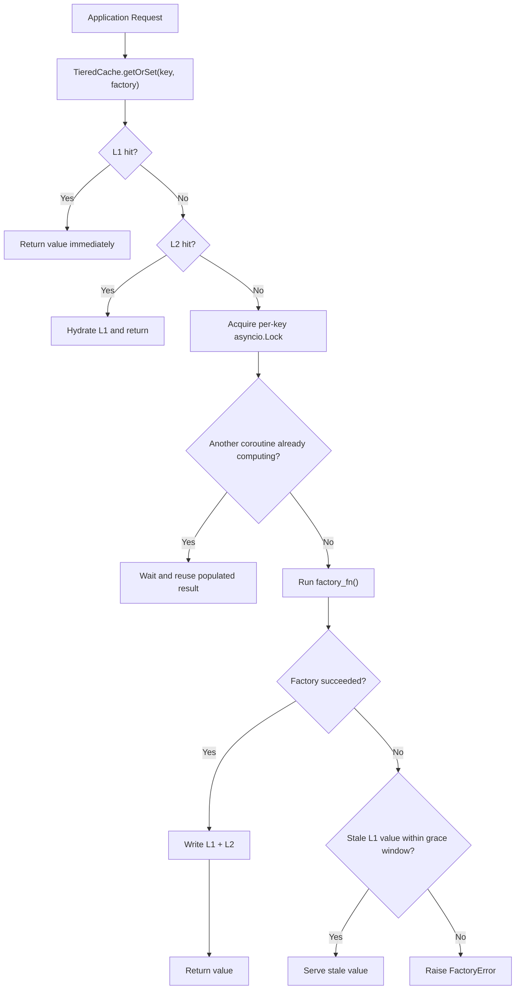

# Shipsy Multi-Tier Caching Library


A high-performance, production-ready two-tier caching library designed for high-throughput environments (e.g., logistics backends). It implements a local-first (L1) and shared-second (L2) strategy to minimize latency and protect downstream systems from cache stampedes.

## Quick Start

Fastest path to see the library working with a realistic logistics use case:

```bash
docker compose -f docker/docker-compose.yml up redis -d
pip install -e .
```

```python
import asyncio

from shipsy_cache import RedisL2, TieredCache


async def main() -> None:
    l2 = RedisL2(
        host="localhost",
        port=6379,
        db=0,
        password=None,
        ssl=False,
        namespace="rates_backend",
        socket_timeout=2.0,
    )
    cache = TieredCache(
        l2_backend=l2,
        l1_max_size=1000,
        default_ttl="10m",
        grace_period="1m",
        namespace="rates",
        event_emitter=None,
    )

    async def fetch_rate() -> dict[str, object]:
        await asyncio.sleep(0.2)
        return {
            "carrier": "delhivery",
            "route": "DEL-BLR",
            "price": 76.25,
            "currency": "INR",
        }

    first = await cache.getOrSet("rate:delhivery:DEL:BLR", fetch_rate, ttl="15m")
    second = await cache.getOrSet("rate:delhivery:DEL:BLR", fetch_rate, ttl="15m")
    print(first)
    print(second)


asyncio.run(main())
```

Primary logistics patterns supported by the same API:

```python
# Rate shopping
rate = await cache.getOrSet(
    f"rate:{carrier}:{origin}:{dest}",
    lambda: carrier_api.get_rate(carrier, origin, dest),
    ttl="15m",
)

# Tracking: high read, short TTL
tracking = await cache.getOrSet(
    f"tracking:{awb}",
    lambda: tracking_api.fetch(awb),
    ttl="30s",
)

# Serviceability: high read, long TTL
serviceability = await cache.getOrSet(
    f"serviceability:{pincode}",
    lambda: serviceability_db.check(pincode),
    ttl="6h",
)
```

## Core Concepts

### Request Flow



### L1 and L2

- **L1** is a bounded in-process LRU cache for fast reads inside a single Python process.
- **L2** is a pluggable async backend. This submission ships with **`RedisL2`** as the working backend implementation.
- **Why this matters for logistics**: a hot route, AWB, or pincode can be read many times per second. L1 absorbs local traffic; Redis provides shared reuse across service instances.

### Cache-Aside

The application asks the cache for a value. On miss, the cache invokes the factory, stores the result, and returns it. This keeps the integration simple for backend services that already have a source of truth.

### Stampede Protection

Without coordination:

```text
50 concurrent requests
-> 50 cache misses
-> 50 upstream calls
-> avoidable load spike
```

With `TieredCache.getOrSet()`:

```text
50 concurrent requests
-> 1 leader acquires the per-key lock
-> 49 followers wait
-> 1 upstream call
-> all 50 callers reuse the same result
```

### TTL and Grace Period

- **TTL** controls freshness.
- **Grace period** is a fallback window after expiry.
- **Why this matters for logistics**: if a carrier rate API briefly fails, serving a slightly stale rate is often better than breaking checkout.

## API Reference

### Constructor

```python
TieredCache(
    l2_backend: Optional[L2Backend] = None,
    l1_max_size: int = 1000,
    default_ttl: Union[int, float, str] = 300,
    grace_period: Union[int, float, str] = 60,
    namespace: str = "default",
    event_emitter: Optional[CacheEventEmitter] = None,
)
```

### Methods

| Method | Signature | Description |
| --- | --- | --- |
| `getOrSet` | `async getOrSet(key, factory_fn, ttl=None)` | Read-through helper with per-key stampede protection. |
| `get` | `async get(key)` | Read from L1, then L2, and return `None` on miss. |
| `set` | `async set(key, value, ttl=None)` | Write a value to both tiers. |
| `invalidate` | `async invalidate(key)` | Remove one logical key from both tiers. |
| `clear` | `async clear()` | Clear L1 and the configured L2 backend. |
| `on` | `on(event, callback)` | Register a lifecycle event listener. |
| `stats` | `stats()` | Return L1 size and cache namespace metadata. |

### Redis Backend

```python
RedisL2(
    host: str = "localhost",
    port: int = 6379,
    db: int = 0,
    password: Optional[str] = None,
    ssl: bool = False,
    namespace: str = "shipsy_cache",
    socket_timeout: float = 2.0,
)
```

## Configuration

This table is the single source of truth for runtime configuration.

| Option | Scope | Default | Description |
| --- | --- | --- | --- |
| `l2_backend` | `TieredCache` | `RedisL2()` | Async L2 backend implementation. |
| `l1_max_size` | `TieredCache` | `1000` | Maximum number of fresh entries in local L1. |
| `default_ttl` | `TieredCache` | `300` | Default TTL for writes; accepts seconds or strings like `5m`. |
| `grace_period` | `TieredCache` | `60` | Window for serving stale L1 data after expiry if the factory fails. |
| `namespace` | `TieredCache` | `"default"` | Logical key prefix used inside the cache. |
| `event_emitter` | `TieredCache` | `CacheEventEmitter()` | Optional custom lifecycle event emitter. |
| `host` | `RedisL2` | `"localhost"` | Redis host, overridable via `REDIS_HOST`. |
| `port` | `RedisL2` | `6379` | Redis port, overridable via `REDIS_PORT`. |
| `db` | `RedisL2` | `0` | Redis database index, overridable via `REDIS_DB`. |
| `password` | `RedisL2` | `None` | Redis password, overridable via `REDIS_PASSWORD`. |
| `ssl` | `RedisL2` | `False` | Enable TLS for Redis connections. |
| `namespace` | `RedisL2` | `"shipsy_cache"` | Storage namespace prefixed to Redis keys. |
| `socket_timeout` | `RedisL2` | `2.0` | Redis socket timeout in seconds. |

### TTL Formats

| Input | Meaning | Seconds |
| --- | --- | ---: |
| `300` | Numeric seconds | `300.0` |
| `30s` | 30 seconds | `30.0` |
| `5m` | 5 minutes | `300.0` |
| `2h` | 2 hours | `7200.0` |
| `1d` | 1 day | `86400.0` |

### Environment Variables

| Variable | Used By | Default | Purpose |
| --- | --- | --- | --- |
| `REDIS_HOST` | `RedisL2` | `localhost` | Redis hostname |
| `REDIS_PORT` | `RedisL2` | `6379` | Redis port |
| `REDIS_DB` | `RedisL2` | `0` | Redis database index |
| `REDIS_PASSWORD` | `RedisL2` | unset | Redis password |

## Production Guide

### Testing

Fastest one-command validation:

```bash
docker compose -f docker/docker-compose.yml up --build --abort-on-container-exit
```

Useful local commands:

```bash
pytest tests/ --ignore=tests/integration -v --cov=shipsy_cache --cov-report=term-missing
```

```bash
export REDIS_HOST=localhost REDIS_PORT=6379
pytest tests/integration/ -v
```

### Deployment Notes

- The library is designed to run embedded inside another Python service.
- L1 is process-local; Redis is the shared layer across instances.
- Redis credentials come from constructor arguments or environment variables.
- No HTTP server, telemetry stack, or distributed synchronization layer is included.

> Production boundary: this submission is production-ready for the core library use case, but intentionally scoped. It focuses on correctness, concurrency behavior, and operability rather than a broad feature surface.

### Troubleshooting

| Symptom | Likely Cause | Action |
| --- | --- | --- |
| `L2UnavailableError` | Redis is unreachable or misconfigured | Check `REDIS_HOST`, `REDIS_PORT`, credentials, and Redis health. |
| Cache entries expire unexpectedly | TTL value interpreted differently than intended | Verify `5m` vs `5`; strings are often clearer than raw integers. |
| Integration tests skip | Redis env vars not set | Export `REDIS_HOST` before running integration tests. |

### CI/CD

GitHub Actions runs [tests.yml](./.github/workflows/tests.yml):

- unit tests on Python 3.10
- Redis-backed integration tests on Python 3.10 using a service container

## Design & Tradeoffs

### Why these choices

- **Python with `asyncio`**: matches the assignment, works naturally with network-bound L2 calls, and keeps the concurrency model explicit.
- **L1 = LRU + TTL**: TTL alone does not bound memory; LRU alone does not enforce freshness. The combination is practical for hot logistics keys.
- **Per-key `asyncio.Lock`**: prevents duplicate upstream calls for the same key while keeping unrelated keys independent.
- **Lazy eviction in L1**: keeps the library small and dependency-free without background housekeeping threads.
- **JSON serialization in L2**: portable, inspectable, and safer than pickle for a shared backend boundary.
- **Grace-period stale serving**: favors operational continuity during transient downstream failures such as carrier API timeouts.
- **Single shipped backend (`RedisL2`)**: keeps the submission focused while preserving a clean L2 interface for future extensions.

### Tradeoffs accepted

- Stampede protection is process-local, not distributed across instances.
- Redis cluster-aware behavior is not implemented.
- L1 hydration from L2 resets to `default_ttl` rather than preserving exact remaining TTL.
- Event hooks exist, but the project does not include a full telemetry stack by design.

### What I would add with more time

- Circuit-breaker behavior around repeated L2 failures so Redis outages do not add latency to every request.
- Batch `getOrSet` support for rate-shopping fan-out patterns where several carrier rates are fetched together.
- Richer stats such as hit rate, stale serves, and inflight contention counts.
- Serializer hooks for teams that want MessagePack or custom encoding.
- Redis cluster-aware testing and more production hardening around failover scenarios.

## How I Used AI

AI was used as an implementation and editing assistant, not as an autopilot. It helped draft code, generate test scaffolding, rewrite documentation, and speed up iterative cleanup, but I still made the final decisions around architecture, scope control, naming, and what to keep or remove so the submission stayed aligned with the assignment rather than becoming overly broad.

## Visual Demo

Optional reviewer-facing demo:

```bash
pip install -e ".[demo]"
python examples/visual_demo.py
```

What it shows:

- rate shopping with cold vs warm latency comparison
- stampede protection under concurrent tracking requests
- TTL lifecycle from fresh to expired
- graceful degradation with stale serving
- L2 to L1 hydration behavior
- event stream visualization

The demo uses a private demo-only backend so it can run without Docker, Redis, or external services.
